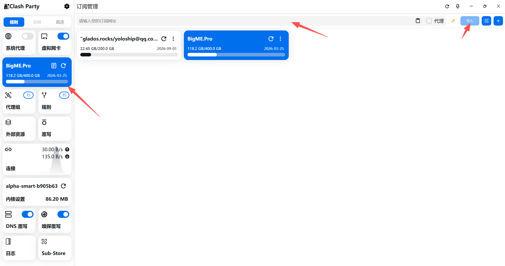
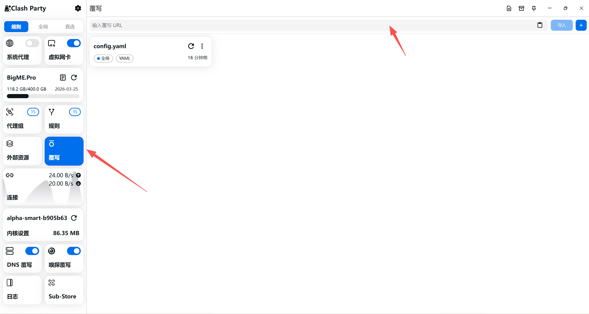
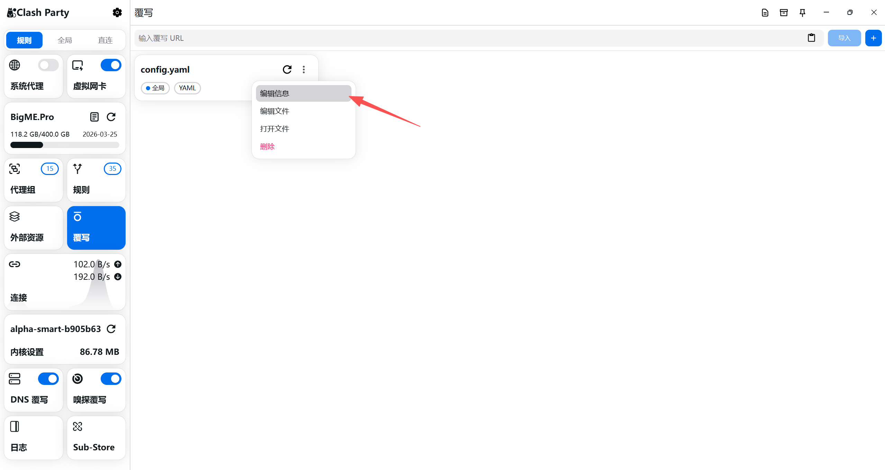
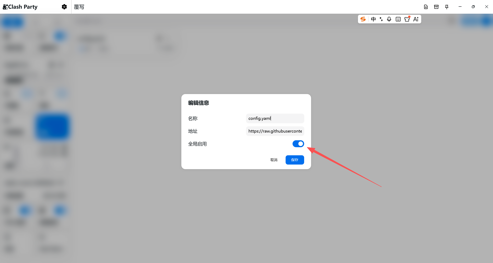
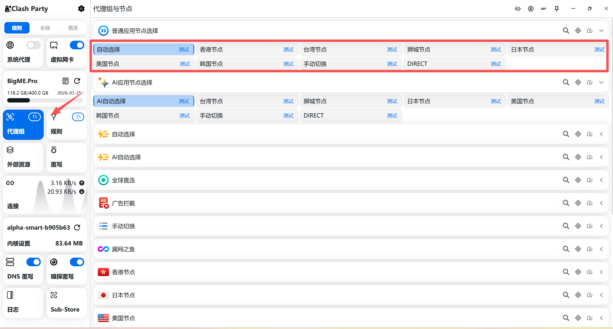
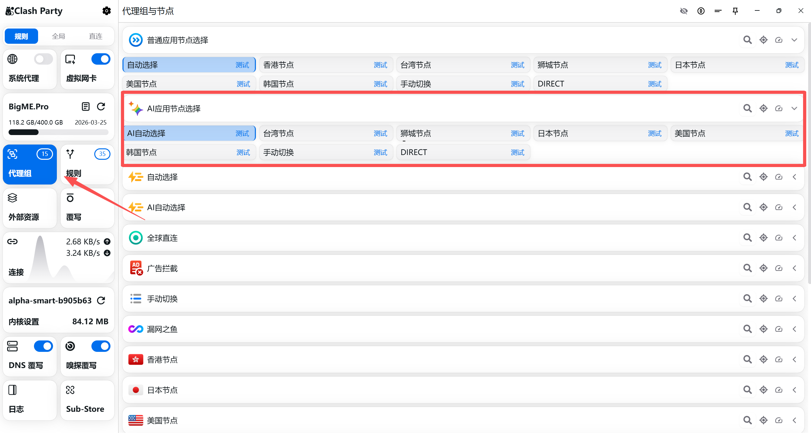

# Proxy Rules

本仓库提供了配合 Clash 系代理软件（如 Clash for Windows, Clash Verge 等）使用的配置和规则分流文件。

## 特色

- 融合了 [ACL4SSR](https://github.com/ACL4SSR/ACL4SSR) 主流的分流规则（如 Google、YouTube、Bilibili、Apple、AI 应用等的分流去广告等）。
- 增加了 **Aspecta** 专属的自定义分流规则和局域网 IP 直连规则。
- 自动化且合理的 `interval` 检查周期配置，避免频繁请求远端造成 Rate Limit。

## 如何使用

建议使用如 [Clash Party](https://github.com/mihomo-party-org/clash-party/releases)、 Clash for Windows 或其它支持 Merge 机制的 Clash GUI 系列软件进行配置。以下以常规导入方式为例。

### 如果您的订阅链接支持直接添加：

1. 打开 Clash 客户端的 **订阅 (Profiles)** 或 **配置** 面板。
2. 将机场/服务商提供的原始订阅链接填入并下载。
   
   

3. 打开虚拟网卡开关, 即可使用。(注意: 使用虚拟网卡之后就不需要打开系统代理了, 所有流量都会被 Clash 捕获, 包括命令行的 curl, wget 等)

   
4. 点击覆写, 在上方的url栏导入该配置: https://raw.githubusercontent.com/aspecta-ai/proxy-rules/refs/heads/main/config.yaml

   
5. 再编辑信息中选择全局启用, 即可使用。
   
   
   

## Aspecta 规则说明

本配置融合了多种分流规则，并在其基础上做了深度定制，主要包含以下策略：

- **普通应用规则**：常规需要代理的域名和应用会默认走 **普通应用节点选择**，您可以手动或者让它自动选择最优的海外节点进行访问, 通常自动选择即可。
  

- **AI 应用规则**：针对 ChatGPT、Claude 等特定 AI 服务，流量会默认走 **AI应用节点选择**。此策略经过特殊调配，会自动排除香港节点（因 AI 平台普遍封锁香港 IP），确保请求通过其他支持的海外节点出站, 通常自动选择即可。
  

- **国内直连规则**：绝大部分国内常见域名、国内媒体服务以及通过 GEOIP 判断为中国大陆的 IP，将直接使用本地网络直连出站 (`DIRECT`)，不浪费代理流量，保证低延迟。
- **广告拦截规则**：集成了反广告拦截黑名单，常见的 APP 广告、跟踪探针会默认走 `REJECT`（拦截），净化您的网络环境。

**自定义文件详述：**
此配置在 `ruleset` 目录下包含 Aspecta 定制的扩展规则：
- **Aspecta.list**: 针对 `aspecta.ai`、`four.meme` 等平台相关域名的代理映射，将默认归类到"普通应用节点"。
- **AspectaInner.list**: 针对常用的局域网和内网 IP 网段（如 `10.0.0.0/8`, `172.16.0.0/12`, `192.168.0.0/16`, `100.64.0.0/10`）进行**完全直连**访问的配置。

在 `config.yaml` 的 `rules` 中，优先级按顺序依次自上而下匹配，未被任何规则捕获的额外流量，将走进配有 `MATCH,漏网之鱼` 的兜底策略。
